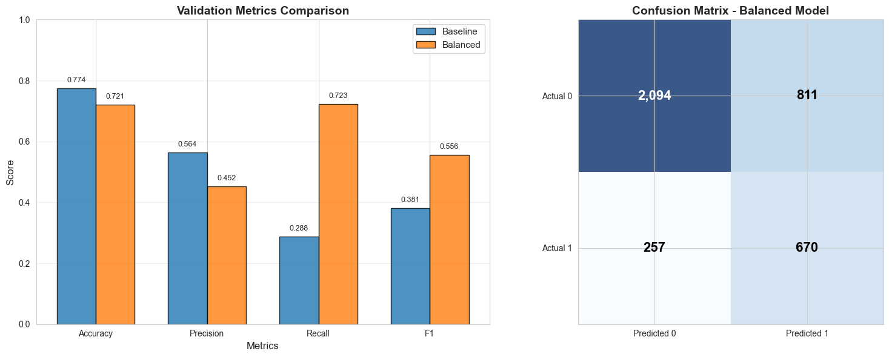

# HR Analytics: Job Change Prediction of Data Scientists

<p align="center">
  
  
  
  
</p>

---

## Mục lục

- [Giới thiệu](#-giới-thiệu)
- [Dataset](#-dataset)
- [Phương pháp](#-phương-pháp)
- [Cài đặt](#-cài-đặt)
- [Sử dụng](#-sử-dụng)
- [Kết quả](#-kết-quả)
- [Cấu trúc dự án](#-cấu-trúc-dự-án)
- [Thách thức & Giải pháp](#-thách-thức--giải-pháp)
- [Hướng phát triển](#-hướng-phát-triển)
- [Contributors](#-contributors)
- [License](#-license)

---

## Giới thiệu

### Mô tả bài toán

Bài toán dự đoán liệu một ứng viên có đang tìm kiếm việc làm mới hay sẽ tiếp tục làm việc tại công ty hiện tại sau khi hoàn thành một khóa đào tạo. Đây là bài toán **binary classification** với:
- **Class 0**: Không tìm kiếm công việc mới (75%)
- **Class 1**: Đang tìm kiếm công việc mới (25%)

### Động lực và ứng dụng thực tế

**Tại sao bài toán này quan trọng?**
1. **Tối ưu chi phí tuyển dụng**: Công ty có thể tập trung nguồn lực vào những ứng viên thực sự có ý định gia nhập
2. **Cải thiện chiến lược đào tạo**: Hiểu rõ yếu tố nào ảnh hưởng đến quyết định của ứng viên
3. **Giảm tỷ lệ churn nhân sự**: Dự đoán sớm để có kế hoạch giữ chân nhân tài

**Ứng dụng thực tế:**
- HR Analytics: Tự động hóa quy trình sàng lọc hồ sơ
- Edtech platforms: Đánh giá hiệu quả khóa học dựa trên mục tiêu nghề nghiệp của học viên
- Recruitment agencies: Matching ứng viên với công ty phù hợp

### Mục tiêu cụ thể

1. **Xây dựng mô hình hoàn chỉnh**: Implement Logistic Regression và toàn bộ pipeline 
2. **Xử lý dữ liệu phức tạp**: Handling missing values, categorical encoding, feature engineering
3. **Xử lý imbalanced data**: Sử dụng class weights để cân bằng
5. **Visualization**: Phân tích EDA, đặt câu hỏi để có insights

---

## Dataset

### Nguồn dữ liệu

Dataset từ cuộc thi **HR Analytics Job Change of Data Scientists** với thông tin của ứng viên đã tham gia các khóa đào tạo.

- **Training set**: 19,158 samples
- **Test set**: 2,129 samples
- **Features**: 14 cột (13 features + 1 target)

### Mô tả các features

| Feature | Kiểu | Mô tả | Missing % |
|---------|------|-------|-----------|
| `enrollee_id` | Categorical | ID duy nhất của ứng viên | 0% |
| `city` | Categorical | Mã thành phố (123 unique) | 0% |
| `city_development_index` | Numeric | Chỉ số phát triển thành phố (0-1) | 0% |
| `gender` | Categorical | Giới tính (Male/Female/Other) | 23.5% |
| `relevent_experience` | Binary | Có kinh nghiệm liên quan (Yes/No) | 0% |
| `enrolled_university` | Categorical | Loại khóa học đại học đang theo học | 2.0% |
| `education_level` | Categorical | Trình độ học vấn | 2.4% |
| `major_discipline` | Categorical | Chuyên ngành | 14.7% |
| `experience` | Ordinal | Tổng số năm kinh nghiệm | 0.3% |
| `company_size` | Ordinal | Quy mô công ty hiện tại | 30.9% |
| `company_type` | Categorical | Loại hình công ty | 32.0% |
| `last_new_job` | Ordinal | Khoảng thời gian công việc trước | 2.2% |
| `training_hours` | Numeric | Số giờ đào tạo hoàn thành | 0% |
| `target` | Binary | 0 = Không đổi việc, 1 = Đổi việc | 0% |

### Kích thước và đặc điểm dữ liệu

**Đặc điểm chính:**
- **Class Imbalance**: Tỷ lệ 3:1 (75% class 0 vs 25% class 1)
- **Missing Values**: 6/14 features có giá trị thiếu (2% - 32%)
- **Mixed Data Types**: Numeric (2), Binary (1), Ordinal (3), Categorical (8)
- **High Cardinality**: Feature `city` có 123 unique values


---

## Phương pháp

### Quy trình xử lý dữ liệu

#### 1. **Missing Values Handling**

Chiến lược xử lý theo tỷ lệ missing:

```python
# Nhóm thiếu nhiều (>20%): Fill with -1 hoặc "Unknown"
if missing_pct > 20:
    fill_value = -1  # Cho ordinal encoding
    
# Nhóm thiếu ít (<15%): Fill with Mode
elif missing_pct < 15:
    fill_value = mode_value
```

#### 2. **Feature Engineering**

**Standardization (Z-score normalization):**

$$
z = \frac{x - \mu}{\sigma}
$$

Áp dụng cho: `city_development_index`, `training_hours`

```python
def standardize(values, mean=None, std=None, fit=True):
    valid = values != missing_value
    if fit:
        mean = np.mean(values[valid])
        std = np.std(values[valid])
    result = np.zeros_like(values)
    result[valid] = (values[valid] - mean) / std
    return result, mean, std
```

**Binary Encoding:**
- `relevent_experience`: Has relevant = 1, No relevant = 0

**Ordinal Encoding:**
- `experience`: 5 bins (<1, 1-2, 3-5, 6-15, >15)
- `company_size`: 8 levels (<10, 10-49, 50-99, ..., 10000+)
- `last_new_job`: 6 levels (never, 1, 2, 3, 4, >4)

**One-Hot Encoding:**
- `enrolled_university`: 3 dummies
- `education_level`: 5 dummies
- `major_discipline`: 6 dummies
- `company_type`: 6 dummies

```python
def one_hot(values, categories=None, fit=True):
    if fit:
        categories = sorted(set(values))
    encoded = np.zeros((len(values), len(categories)))
    for i, v in enumerate(values):
        if v in categories:
            encoded[i, categories.index(v)] = 1
    return encoded, categories
```

**Interaction Features:**
- `experience_bin × relevent_experience`: Tương tác giữa kinh nghiệm và độ liên quan
- `company_size × last_new_job`: Tương tác quy mô công ty và tính ổn định

**Missing Indicators:**
- Binary flags cho các features có missing values

**Kết quả:** 14 features gốc → **39 features** sau preprocessing

#### 3. **Features loại bỏ**
- `enrollee_id`: ID không có ý nghĩa dự đoán
- `city`: Quá nhiều categories (123), thay bằng `city_development_index`

---

### Thuật toán: Logistic Regression với Gradient Descent

#### Công thức toán học

**1. Sigmoid:**

$$
h_\theta(x) = \sigma(z) = \frac{1}{1 + e^{-z}}
$$

$$
z = \theta_0 + \theta_1 x_1 + \theta_2 x_2 + ... + \theta_n x_n = \theta^T x
$$
- Với $x_i$ là các feature được sử dụng cho bài toán phân loại

**2. Cost Function (Log Loss):**

**Binary Cross-Entropy:**

$$
J(\theta) = -\frac{1}{m} \sum_{i=1}^{m} \left[ y^{(i)} \log(h_\theta(x^{(i)})) + (1 - y^{(i)}) \log(1 - h_\theta(x^{(i)})) \right]
$$

**Normal cost function with class weight and L2 regularization (imbalance dataset):**

$$
J(\theta) = -\frac{1}{m} \sum_{i=1}^{m} w_i \left[ y^{(i)} \log(h_\theta(x^{(i)})) + (1 - y^{(i)}) \log(1 - h_\theta(x^{(i)})) \right] + \frac{\lambda}{2m} \sum_{j=1}^{n} \theta_j^2
$$

Trong đó:
- $m$: số lượng samples
- $y^{(i)}$: label thực tế (0 hoặc 1) của sample thứ $i$
- $h_\theta(x^{(i)})$: xác suất dự đoán cho sample thứ $i$
- $w_i$: trọng số của sample thứ $i$ (để xử lý class imbalance)
- $\lambda$: hệ số regularization (L2, giảm overfitting)
- $n$: số lượng features

**3. Gradient:**


$$
\frac{\partial J}{\partial \theta_j} = \frac{1}{m} \sum_{i=1}^{m} \left( h_\theta(x^{(i)}) - y^{(i)} \right) x_j^{(i)}
$$


**4. Gradient Descent Update:**

$$
\theta_j := \theta_j - \alpha \frac{\partial J}{\partial \theta_j}
$$

Trong đó $\alpha$ là learning rate.

**5. Class Weights (xử lý imbalanced data):**

$$
w_{\text{class}} = \frac{n_{\text{samples}}}{n_{\text{classes}} \times n_{\text{samples in class}}}
$$

- Class 0 (75%): weight ≈ 0.67
- Class 1 (25%): weight ≈ 2.0

---

### Implementation bằng NumPy

#### **Sigmoid Function**

```python
def _sigmoid(z: np.ndarray) -> np.ndarray:
    return 1.0 / (1.0 + np.exp(z))
```

#### **Forward Propagation (Vectorized)**

```python
def predict_proba(self, X: np.ndarray) -> np.ndarray:
    # Thêm bias term 
    X_aug = np.hstack((np.ones((X.shape[0], 1)), X))
    
    # Tính z = X @ weights
    logits = np.einsum("ij,j->i", X_aug, self.weights)
    
    # Áp dụng sigmoid
    return _sigmoid(logits)
```


#### **Train/Test Split**

```python
def train_test_split(X, y, test_size=0.2, shuffle=True, random_state=42):
    n_samples = X.shape[0]
    indices = np.arange(n_samples)
    
    if shuffle:
        rng = np.random.default_rng(random_state)
        rng.shuffle(indices)
    
    split_idx = int(n_samples * (1 - test_size))
    train_idx, test_idx = indices[:split_idx], indices[split_idx:]
    
    return X[train_idx], X[test_idx], y[train_idx], y[test_idx]
```

---

## Cài đặt

### Yêu cầu hệ thống

- Python 3.8+
- NumPy 1.26.4
- Matplotlib 3.8.2
- Seaborn 0.13.0

### Các bước cài đặt

**1. Clone repository:**

```bash
git clone <repo>
cd "HR Analytics"
```

**2. Cài đặt dependencies:**

```bash
pip install -r requirements.txt
```

**File `requirements.txt`:**
```
numpy==1.26.4
matplotlib==3.8.2
seaborn==0.13.0
```

---

## Sử dụng

### Workflow hoàn chỉnh

#### **Step 1: Exploratory Data Analysis (EDA)**

```bash
# Mở Jupyter notebook hoặc chạy trực tiếp
jupyter notebook notebooks/01_data_exploration.ipynb
```

**Hoặc chạy từng phần trong notebook:**
- Load và khám phá dữ liệu
- Phân tích missing values
- Trực quan hóa mối quan hệ giữa features và target
- Phân tích correlation

#### **Step 2: Data Preprocessing**

```bash
jupyter notebook notebooks/02_preprocessing.ipynb
```
**Hoặc chạy từng phần trong notebook (recommend)**

**Output:**
- `data/processed/train_processed.csv`: 19,158 samples × 40 features
- `data/processed/test_processed.csv`: 2,129 samples × 39 features
- `data/processed/artifacts.json`: Scaling parameters và categories

#### **Step 3: Model Training & Evaluation**

```bash
jupyter notebook notebooks/03_modeling.ipynb
```
**Hoặc chạy từng phần trong notebook (recommend)**


---

## Kết quả

### Metrics đạt được

| Model | Accuracy | Precision | Recall | 
|-------|----------|-----------|--------|
| **Baseline** (No weights) |  0.7740   | 0.5645 | 0.2880 | 
| **Balanced** (With weights) | 0.7213 | 0.4524 | 0.7228 | 

### Visualizations


*Hình 1: Loss giảm dần và hội tụ sau ~200 epochs*


*Hình 2: Accuracy ổn định quanh 75-78%*

---

## 📁 Cấu trúc dự án

```
HR Analytics/
│
├── README.md                
├── requirements.txt          # Dependencies
│
├── data/                     # Dữ liệu
│   ├── raw/                  # Dữ liệu gốc
│   │   ├── aug_train.csv     
│   │   ├── aug_test.csv      
│   │   └── sample_submission.csv
│   │
│   └── processed/            # Dữ liệu đã xử lý
│       ├── train_processed.csv  
│       ├── test_processed.csv   
│       └── artifacts.json        # Scaling params & categories
│
├── notebooks/                # Jupyter notebooks
│   ├── 01_data_exploration.ipynb   # EDA, visualizations, insights
│   ├── 02_preprocessing.ipynb      # Data cleaning & feature engineering
│   └── 03_modeling.ipynb           # Training, evaluation, comparison
│
├── src/                      # Source code 
│   ├── __init__.py
│   ├── data_processing.py    # Preprocessing pipeline  
│   │
│   ├── models.py             # ML models 
│   │
│   └── visualization.py      # Plotting functions 
│
└── outputs/                  # Kết quả dự đoán
    └── submission.csv # Predictions cho test set
```
---

## Thách thức & Giải pháp

### Thách thức 1: Không có Pandas

**Vấn đề:**
- Không có `pd.read_csv()`, `pd.fillna()`, `pd.get_dummies()`
- Phải xử lý missing values và categorical encoding thủ công

**Giải pháp:**
```python
# Đọc CSV với NumPy
data = np.genfromtxt(filepath, delimiter=',', skip_header=1, 
                     dtype=str, encoding='utf-8')
with open(filepath, 'r') as f:
    headers = f.readline().strip().split(',')

# One-hot encoding thủ công
def one_hot(values, categories=None, fit=True):
    if fit:
        categories = sorted(set(values))
    encoded = np.zeros((len(values), len(categories)))
    for i, v in enumerate(values):
        if v in categories:
            encoded[i, categories.index(v)] = 1
    return encoded, categories
```

### Thách thức 2: Không có Scikit-learn

**Vấn đề:**
- Không có `LogisticRegression()`, `train_test_split()`, `classification_report()`
- Phải implement từ đầu toàn bộ ML pipeline


### Thách thức 3: Class Imbalance (75% vs 25%)

**Vấn đề:**
- Model bias về class 0 (majority class)
- Precision cao nhưng Recall thấp cho class 1

**Giải pháp:**
```python
# Tính class weights
class_weights = {
    0: len(y) / (2 * count_class_0), 
    1: len(y) / (2 * count_class_1)  
}

# Áp dụng vào loss function
sample_weights = np.array([class_weights[int(label)] for label in y])
weighted_loss = np.sum(sample_weights * individual_losses) / np.sum(sample_weights)
```


### Thách thức 4: High Cardinality Feature (`city` = 123 values)

**Vấn đề:**
- One-hot encoding tạo 123 features mới → curse of dimensionality
- Overfitting risk cao

**Giải pháp:**
- **Loại bỏ** `city` feature
- **Giữ lại** `city_development_index` (đã capture thông tin về thành phố)

### Thách thức 5: Missing Values nhiều (>30%)

**Vấn đề:**
- `company_size`: 30.9% missing
- `company_type`: 32.0% missing
- Không thể bỏ samples (mất quá nhiều dữ liệu)

**Giải pháp:**
1. **Ordinal encoding**
2. **Replace bằng mode**
3. **Feature interactions**

---

## Hướng phát triển

### Cải thiện Model
 **Advanced Feature Engineering**
   - Polynomial features (degree 2)
   - Target encoding cho `city` (with cross-validation)
   - Binning cho `training_hours`


## Contributors

 **Trần Tạ Quang Minh** - 23122042
 **email: ttqminh2005@gmail.com, github: coutMinh**

---


---

## License

### Dataset License

The original dataset used in this project is from [HR Analytics: Job Change of Data Scientists](https://github.com/josumsc/hr-analytics-ds) and is licensed under the **GNU General Public License v3.0**.

[](https://www.gnu.org/licenses/gpl-3.0)

---

